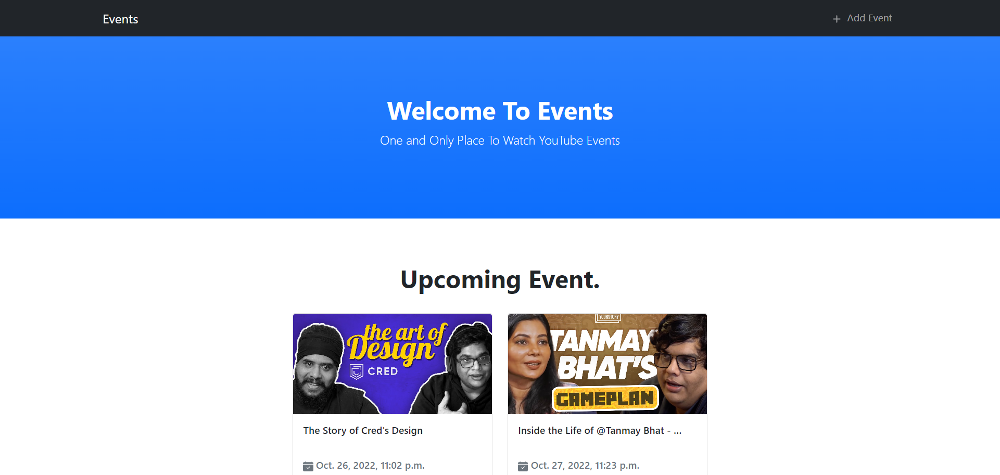
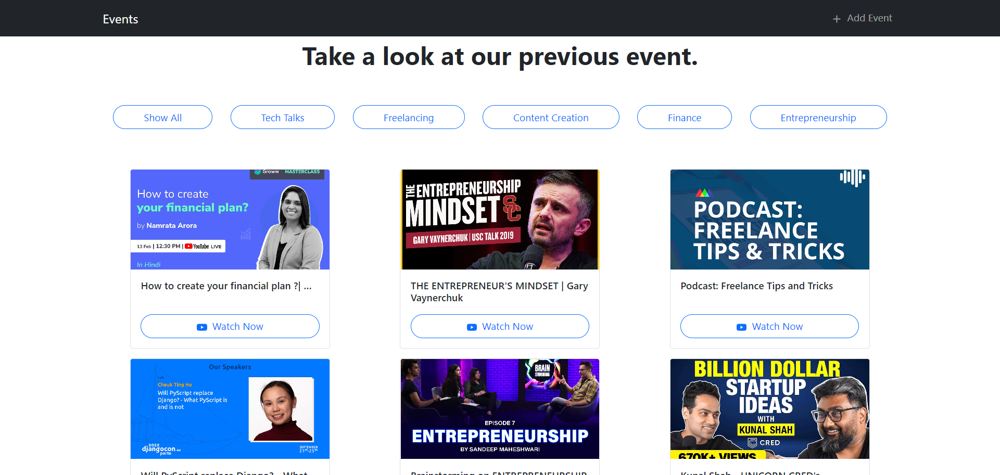
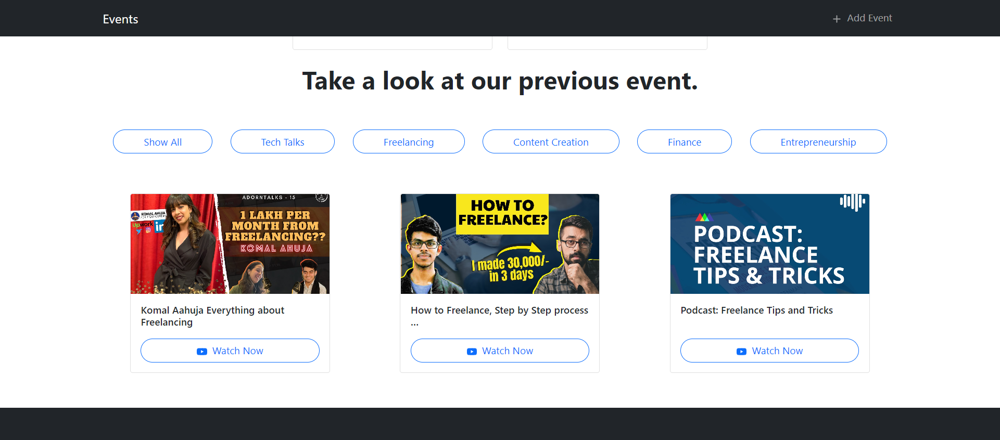
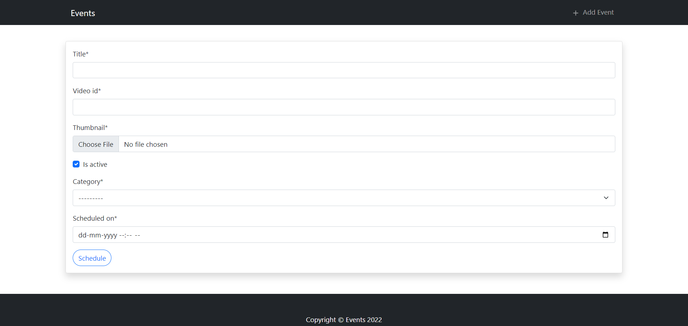

### Running it Locally

_This application is running on python 3.10 and Django 4. This is running on Python 3.10 and Django 4. Create a virtual environment and install the packages from requirements.txt.._

```
pip install -r requirements.txt
python manage.py runserver
```

### Tech Stack

- Django
- Bootstrap
- JavaScript

## Screenshots

### Home Page / Upcoming Events



### Past Events



### Filtered Events



### Scheduling a new Event


